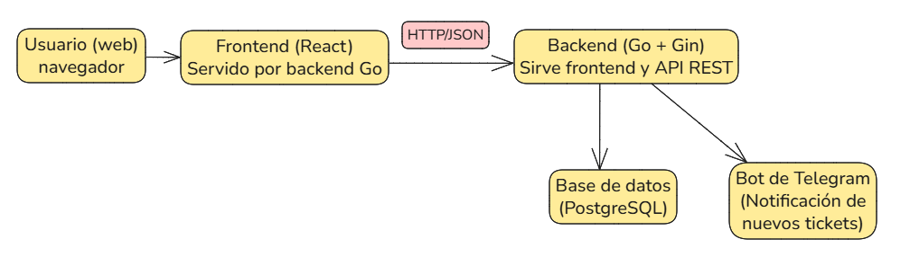

# Arquitectura del Sistema

## Descripción de alto nivel

La **Plataforma de Gestión de Incidencias** está diseñada para operar dentro de la red local del Instituto Catastral del Estado de Oaxaca. El sistema está compuesto por una aplicación frontend desarrollada en **React** y un backend implementado en **Go (GIN)**, los cuales están desplegados en el **mismo servidor**.

No se utiliza servidor web (como Nginx) ni balanceadores de carga. Todo el tráfico HTTP es atendido directamente por el backend en Go, que también se encarga de servir estáticamente los archivos del frontend.

El sistema cuenta con dos entornos:

- **Producción (prod)**: usado por los usuarios finales.
- **Desarrollo (dev)**: usado para pruebas y validación.

Ambos entornos están alojados en servidores distintos, y su comportamiento se ajusta mediante variables de entorno.

El control de versiones del sistema se gestiona exclusivamente mediante Git. No existe una versión formal desplegada; se asume que el servidor corre siempre con la última versión confirmada en GitHub.

---

## Comunicación entre frontend y backend

- El frontend en React se aloja directamente desde el backend en Go.
- La comunicación entre frontend y backend es vía **HTTP**, usando peticiones `fetch` que intercambian datos en formato **JSON**.
- No se utilizan WebSockets ni ningún otro canal en tiempo real fuera del bot de Telegram.
- Para navegación dentro del frontend se emplea **React Router**.

---

## Flujo básico de datos

### 1. Levantamiento de ticket (usuario sin cuenta)

1. Usuario accede a la plataforma.
2. Se muestra el formulario de creación de ticket.
3. El frontend consulta opciones de tipo y área mediante:
   - `GET /ObtenerTipoTicketsActivos`
   - `GET /ObtenerAreasActivos`
4. El usuario llena y envía el formulario.
5. El frontend valida los datos y los envía al backend con `POST /CrearTicket`.
6. El backend valida la información, la guarda en la base de datos y registra logs de trazabilidad.
7. Se envía una notificación vía Telegram.
8. Se marca en la base de datos si la notificación fue exitosa (y se reintenta cada minuto en caso contrario).
9. El backend responde con un mensaje de éxito.

---

### 2. Inicio de sesión (usuario con cuenta)

1. Usuario accede al sistema.
2. Ingresa al formulario de inicio de sesión.
3. El frontend valida los datos y los envía vía `POST /IniciarSesion`.
4. El backend:
   - Verifica existencia del usuario y que esté habilitado.
   - Valida la contraseña con bcrypt.
   - Elimina sesiones anteriores activas.
   - Crea un nuevo token UUID.
   - Registra la sesión con expiración de 1 hora y logs de trazabilidad.
   - Retorna token y privilegios del usuario.

---

### 3. Atención de tickets (usuario autenticado)

1. Usuario inicia sesión.
2. Accede a la vista de tickets.
3. El frontend realiza `GET /ObtenerTickets`.
4. El backend filtra los tickets visibles según las áreas asignadas al usuario.
5. El usuario filtra y selecciona el ticket deseado.
6. El frontend consulta detalles del ticket con `GET /ObtenerTicketPorID/:id`.
7. El backend devuelve la información correspondiente.
8. El frontend muestra el formulario prellenado.
9. El usuario edita el estatus y/o área de soporte.
10. El frontend envía los cambios vía `PATCH /ActualizarTicket`.
11. El backend:
    - Valida los datos recibidos.
    - Obtiene datos actuales del ticket.
    - Verifica permisos del usuario.
    - Registra logs en caso de cambios en área o estatus.
    - Responde con mensaje de éxito.

---

## Diagrama de arquitectura

