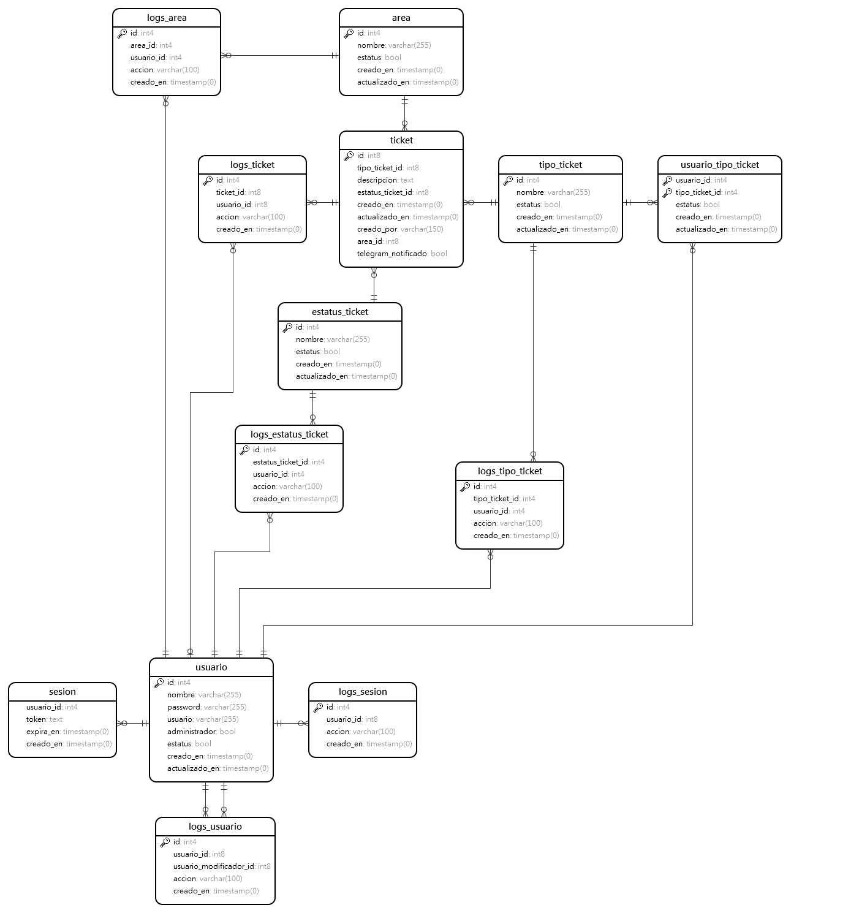

# Base de datos – Plataforma de Gestión de Incidencias

Este archivo documenta la estructura de la base de datos. Se incluyen las tablas principales, sus relaciones y campos relevantes, así como una visión general del modelo de datos y sus propósitos.

---

## 📌 Descripción general

La base de datos está diseñada para gestionar un sistema de tickets de soporte interno. Se compone de entidades principales como `usuario` y `ticket`, catálogos auxiliares y tablas de trazabilidad (logs). Todas las relaciones están normalizadas, y se utilizan claves foráneas para garantizar integridad referencial.

---

## 🧩 Diagrama Entidad-Relación

---

## 📚 Tablas principales

### `usuario`

Contiene la información de los usuarios del sistema.

Campos clave:

- `nombre`: nombre completo del usuario.
- `usuario`: nombre de usuario (único).
- `password`: hash de contraseña.
- `administrador`: booleano para control de permisos.
- `estatus`: booleano para control de activación/desactivación.

---

### `ticket`

Registro de tickets de soporte generados por los usuarios.

Campos clave:

- `tipo_ticket_id`: referencia al área de soporte.
- `descripcion`: detalle del problema.
- `estatus_ticket_id`: estatus actual del ticket.
- `creado_por`: nombre del usuario que lo creó.
- `area_id`: área que origina el ticket.
- `telegram_notificado`: si ya se notificó vía Telegram.

---

### `area`

Catálogo de áreas de adscripción dentro del Instituto.

Campos: `nombre`, `estatus`, timestamps.

---

### `estatus_ticket`

Catálogo de posibles estatus que puede tener un ticket.

Ejemplo: Pendiente, Cancelado, Finalizado.

---

### `tipo_ticket`

Catálogo de áreas que atienden los tickets.

Ejemplo: Internet y redes, Soporte técnico y mantenimiento, Sistema SITEO.

---

### `usuario_tipo_ticket`

Tabla intermedia (muchos a muchos) que define qué usuarios pueden atender qué tipo de tickets.

Campos: `usuario_id`, `tipo_ticket_id`, `estatus`, timestamps.

---

### `sesion`

Manejo de tokens de sesión para los usuarios.

Campos: `usuario_id`, `token`, `expira_en`, `creado_en`.

---

## 🧾 Trazabilidad: Tablas de Logs

Todas estas tablas siguen la misma estructura:

- `id`
- `<entidad>_id`: referencia al registro modificado.
- `usuario_id` (o `usuario_modificador_id`): quién hizo el cambio.
- `accion`: descripción de la acción (`crear`, `editar`, `eliminar`, etc.).
- `creado_en`: timestamp del evento.

Tablas:

- `logs_usuario`
- `logs_area`
- `logs_estatus_ticket`
- `logs_tipo_ticket`
- `logs_sesion`

---

## 🔗 Relaciones clave

- Un `ticket` pertenece a una `area`, un `estatus_ticket`, y un `tipo_ticket`.
- Un `usuario` puede estar relacionado con varios `tipo_ticket` a través de `usuario_tipo_ticket`.
- Las tablas de logs están relacionadas con su tabla principal y con el `usuario` que realiza la acción.
- `sesion` se relaciona con `usuario`.
